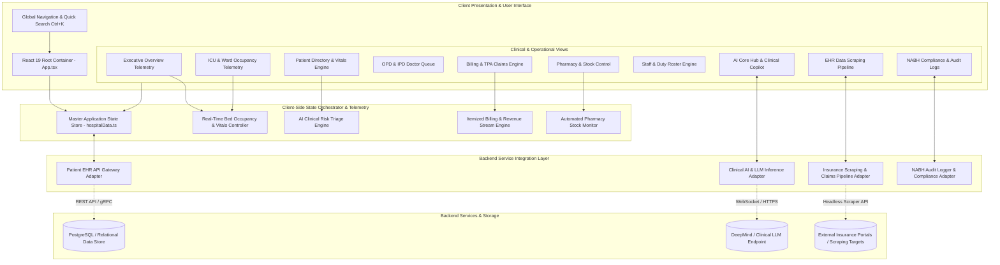
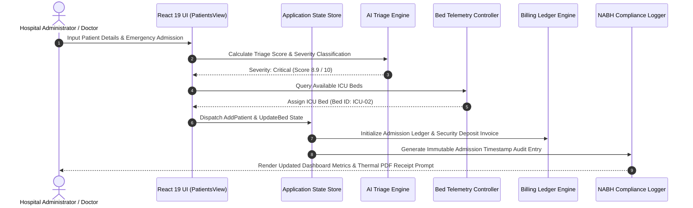
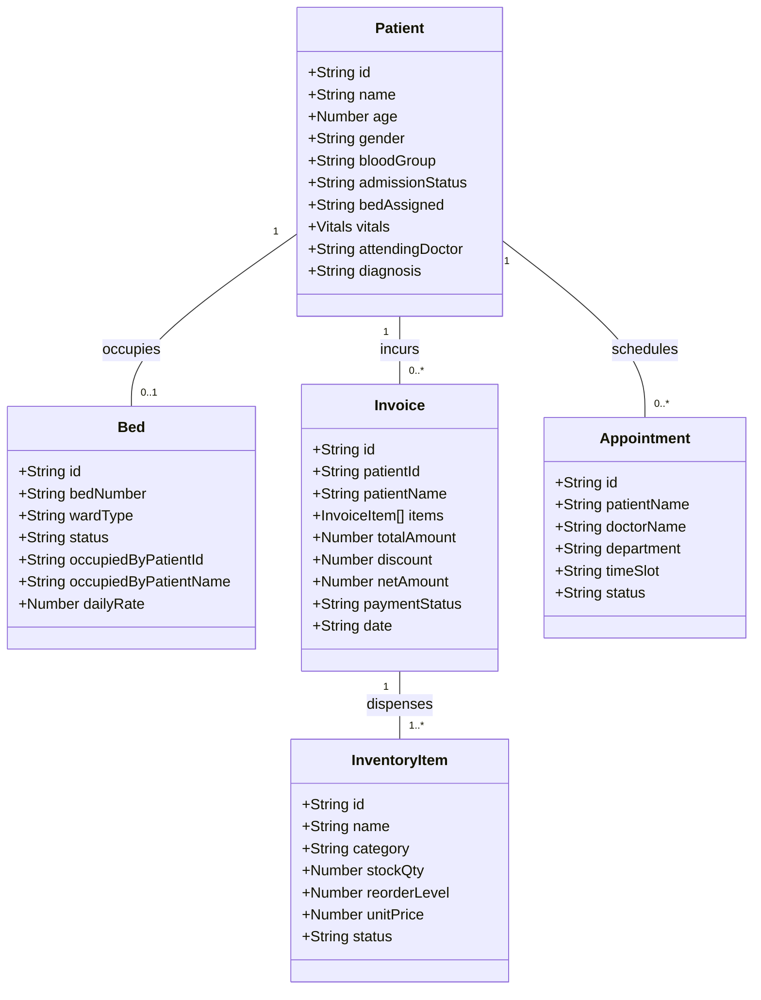

<div align="center">

# 🏥 SHISHUTAA.ERP
### Super Specialty Hospital & Pediatric Care Enterprise Platform

[](https://pratapdabhade16.github.io/intern-/)
[](https://github.com/PratapDabhade16/intern-)

[](https://react.dev/)
[](https://www.typescriptlang.org/)
[](https://vitejs.dev/)
[](https://tailwindcss.com/)
[](LICENSE)

</div>

---

## 📌 Executive Summary

**SHISHUTAA.ERP** is a full-stack ready, state-of-the-art Enterprise Healthcare Operations & Clinical Telemetry platform specifically engineered for super-specialty hospitals and pediatric care centers. 

It provides hospital directors, chief medical officers, and clinical administrators with real-time operational telemetry across emergency wards, ICU bed allocation, patient vital monitoring, automated revenue accounting, pharmacy reorder thresholds, AI-assisted voice triage, external web scrapers for insurance data, and immutable NABH compliance audit trails.

---

## 🌐 Live Application & Deployment

| Resource | URL / Access Link |
| :--- | :--- |
| **Production Web App** | 🔗 [https://pratapdabhade16.github.io/intern-/](https://pratapdabhade16.github.io/intern-/) |
| **Source Repository** | 📦 [https://github.com/PratapDabhade16/intern-](https://github.com/PratapDabhade16/intern-) |
| **Deployment Pipeline** | ⚡ GitHub Pages (Automated via GitHub Actions & `gh-pages`) |

---

## 📐 System Architecture & Design

### 1. High-Level Modular System Architecture

The application implements a decoupled, event-driven architecture. The user interface is driven by React 19 micro-views that communicate with a central reactive state manager, designed for drop-in RESTful or gRPC backend API microservices integration.



---

### 2. Clinical Data Flow & Admission Telemetry Pipeline



---

### 3. Entity & State Relationship Model



---

## 🔥 Key System Features & Operational Modules

### 1. 📊 Executive Overview & Live Telemetry
- **Live Hospital Metrics**: Real-time telemetry tracking active patient load, ICU occupancy rate, daily billed revenue, and active emergency alerts.
- **Departmental Telemetry Chart**: Interactive stacked area chart powered by `Recharts` displaying 24-hour patient volume across ICU, General, and Pediatric wards.
- **Revenue Stream Breakdown**: Bar chart analytics highlighting departmental revenue allocation (Procedures, Room Rent, Pharmacy, Diagnostics, Consultation).

### 2. 🏥 Patient Management & AI Clinical Risk Triage
- **Directory Filtering**: Instant searching and filtering across Inpatients, Outpatients, and Emergency admissions.
- **Real-Time Vitals Tracking**: Color-coded physiological telemetry for Blood Pressure, Heart Rate, SpO2 (Oxygen Saturation), and Blood Sugar levels.
- **One-Click Billing Generation**: Instant dispatch from patient record to billing ledger.

### 3. 🛏️ ICU & Ward Occupancy Telemetry
- **Interactive Bed Matrix**: Color-coded visualization of bed statuses (`Occupied`, `Available`, `Cleaning`, `Maintenance`).
- **Dynamic Bed Assignment**: Reassign patients between ICU, NICU, General, and Private wards with instant capacity recalculation.
- **Life Support Monitoring**: Real-time tracking of ventilator connectivity and oxygen flow lines per bed.

### 4. 📅 OPD & IPD Doctor Queue Telemetry
- **Specialty Queue Management**: Appointment scheduling across Pediatrics, Cardiology, Orthopedics, and Emergency Medicine.
- **Workflow State Engine**: Transition appointments through `Scheduled` ➔ `In-Consultation` ➔ `Completed` or `Cancelled`.

### 5. 💳 Billing, TPA Claims & Invoice Printing
- **Itemized Ledger Builder**: Automatic fee accumulation covering room tariff, clinical procedures, diagnostic tests, and pharmacy dispensations.
- **Printable Thermal PDF Invoices**: Integrated invoice generator modal with header branding, tax breakdowns, payment QR codes, and hospital authorization seals.
- **Insurance TPA Claims Engine**: Management of cashless insurance pre-authorizations and claim approvals.

### 6. 💊 Pharmacy Inventory & Automated Reordering
- **Stock Threshold Telemetry**: Real-time stock categorizations into `In Stock`, `Low Stock`, and `Critical`.
- **Instant Medication Dispenser**: Dispenses prescriptions and recalculates remaining stock and reorder triggers instantly.

### 7. 🤖 AI Core Hub & Clinical Copilot
- **Voice Call Telemetry Engine**: Transcript logging of patient voice inquiries, AI symptom triage summaries, and sentiment scores.
- **AI Recommendation Engine**: Automated risk warnings for potential drug interactions and bed capacity alerts.

### 8. 🌐 EHR Web Scraping & Data Aggregation
- **Web Scraping Pipeline**: Simulated headless browser automation scraping government healthcare portal updates, insurance TPA policy revisions, and pharmaceutical market pricing.
- **Job Trigger Controls**: Trigger manual scrape refreshes with live record extraction throughput metrics.

### 9. 📋 NABH Compliance & Immutable Audit Trails
- **Clinical Governance Audit**: Detailed event logging tracking infection control compliance, equipment sterilization logs, and patient safety protocols.
- **NABH Scorecard**: Real-time compliance rating progress bar required for national hospital accreditation.

---

## 🛠️ Technical Stack & Dependencies

```
-------------------------------------------------------------------------------
Core Framework    :: React 19.2.8 | TypeScript 6.0.2 | Vite 8.3.2
Styling Engine    :: Tailwind CSS v4.3.3 | Custom CSS Design Tokens
Iconography       :: Lucide React v1.51.0
Data Visuals      :: Recharts v3.10.1
Interactive UX    :: Canvas Confetti v1.9.4
Linting & Quality :: Oxlint v1.81.0
CI/CD Pipeline    :: GitHub Actions (.github/workflows/deploy.yml)
-------------------------------------------------------------------------------
```

---

## 📂 Repository Directory Structure

```
internship/
├── .github/
│   └── workflows/
│       └── deploy.yml          # GitHub Actions Automated CI/CD Workflow
├── public/
│   ├── favicon.svg             # Platform Favicon
│   └── icons.svg               # SVG Icon sprite assets
├── src/
│   ├── assets/                 # Branding & Vector Assets
│   ├── components/             # React View Components & Modals
│   │   ├── AiHubView.tsx       # AI Triage & Voice Call Telemetry Engine
│   │   ├── AppointmentsView.tsx# OPD/IPD Doctor Queue & Schedule Engine
│   │   ├── BedsView.tsx        # Bed & ICU Occupancy Telemetry Grid
│   │   ├── BillingView.tsx     # Itemized Ledger & TPA Claims Engine
│   │   ├── ComplianceView.tsx  # NABH Audit & Compliance Governance
│   │   ├── DashboardView.tsx   # Executive Overview & Telemetry Dashboard
│   │   ├── Navbar.tsx          # Top Header, Quick Search & Role Selector
│   │   ├── PatientsView.tsx    # Patient Directory & Vitals Monitor
│   │   ├── PharmacyView.tsx    # Stock Control & Auto-Reorder Engine
│   │   ├── PrintBillModal.tsx  # Printable Thermal PDF Invoice Generator
│   │   ├── QuickSearchModal.tsx# Global Command Palette (Ctrl+K)
│   │   ├── ScrapingView.tsx    # EHR Scraping & Data Aggregation Pipeline
│   │   ├── ShishutaaLogo.tsx   # SVG Brand Component
│   │   ├── Sidebar.tsx         # Left Navigation Sidebar
│   │   └── StaffView.tsx       # Staff Directory & Roster Control
│   ├── data/
│   │   └── hospitalData.ts     # Master Data Schemas & Stateful Store
│   ├── App.css                 # Custom Styling Tokens & Animations
│   ├── App.tsx                 # Root Container & State Orchestrator
│   ├── index.css               # Tailwind CSS v4 Entry Point
│   └── main.tsx                # React DOM Mount Entry Point
├── package.json                # Dependencies, Scripts & Deploy Command
├── tsconfig.json               # TypeScript Compiler Setup
├── tsconfig.app.json           # Application TypeScript Options
└── vite.config.ts              # Vite Bundler Setup with Relative Base Path
```

---

## ⚡ Local Development & Setup Guide

### 1. Prerequisites
Ensure you have the following installed on your machine:
- **Node.js**: `v18.0.0` or higher
- **npm**: `v9.0.0` or higher
- **Git**: `v2.25.0` or higher

### 2. Installation Commands

```bash
# Clone the GitHub repository
git clone https://github.com/PratapDabhade16/intern-.git

# Navigate into the project directory
cd intern-

# Install dependencies
npm install
```

### 3. Execution Commands

| Command | Action | Output / Behavior |
| :--- | :--- | :--- |
| `npm run dev` | Starts local Vite development server | Opens app at `http://localhost:5173/` |
| `npm run build` | Compiles TypeScript and builds production bundle | Outputs static files to `dist/` |
| `npm run preview` | Previews production build locally | Simulates production HTTP server |
| `npm run deploy` | Builds and deploys bundle to GitHub Pages | Deploys live to `gh-pages` branch |
| `npm run lint` | Runs Oxlint linter check | Validates code formatting & types |

---

## 🚀 Deployment Guide

### Deploying to GitHub Pages (Automatic)

This repository includes a GitHub Actions workflow configured in `.github/workflows/deploy.yml`.

1. Push your changes to the `main` branch:
   ```bash
   git add .
   git commit -m "feat: updates for production"
   git push origin main
   ```
2. Navigate to your GitHub Repository **Settings > Pages**.
3. Under **Build and deployment > Source**, select **GitHub Actions**.
4. GitHub Actions will automatically compile and deploy your web application!

### Deploying via Npm CLI Command
Alternatively, you can trigger instant manual deployment to GitHub Pages using:
```bash
npm run deploy
```

---

## 📄 License

Distributed under the **MIT License**. See `LICENSE` for more information.

<div align="center">
  <sub>Built with ❤️ for Super Specialty & Pediatric Healthcare Innovation</sub>
</div>
