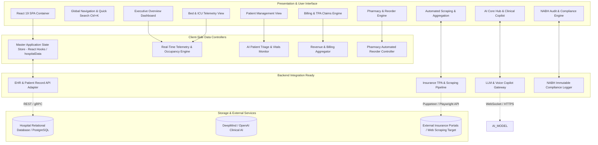
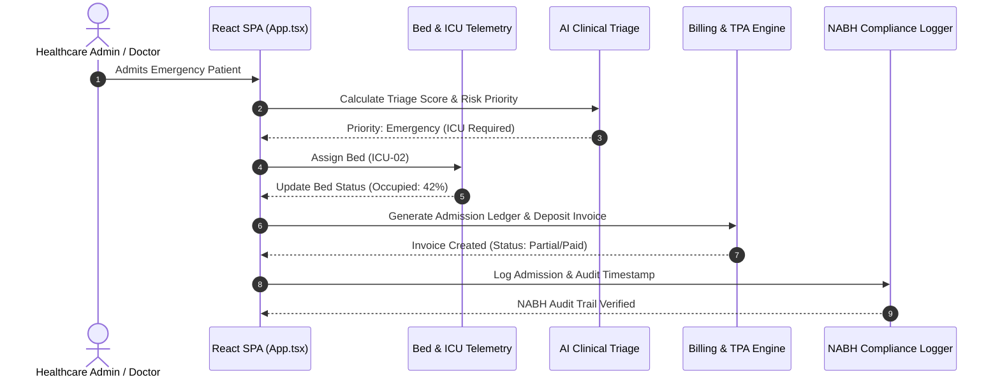

# 🏥 SHISHUTAA.ERP — Super Specialty Hospital & Pediatric Care Platform

[](https://react.dev/)
[](https://www.typescriptlang.org/)
[](https://vitejs.dev/)
[](https://tailwindcss.com/)
[](LICENSE)

**SHISHUTAA.ERP** is a next-generation Enterprise Healthcare Resource Planning & Clinical Telemetry Platform designed for super specialty hospitals and pediatric care centers. It integrates real-time telemetry, automated bed occupancy engines, AI-powered patient triage, financial revenue streams, pharmacy inventory tracking, automated web scraping for insurance data, and NABH compliance auditing.

---

## 📐 System Architecture & Design

### High-Level Architecture

The system is architected as a **High-Performance Single Page Application (SPA)** with an integrated **Client-Side State Engine** that simulates backend services via mock data controllers, while being fully prepared for microservices/REST backend integration.



---

## 🔄 Component Data Flow & Telemetry



---

## ⚡ Core Features & Functional Breakdown

### 1. 📊 Executive Overview & Live Telemetry
- **Hospital Capacity Metrics**: Live telemetry monitoring active patient volume, ICU occupancy %, daily revenue, and emergency alerts.
- **Department Occupancy Telemetry**: Interactive area charts (`Recharts`) tracking patient volume trends across General, ICU, and Pediatric wards.
- **Quick Action Triggers**: Immediate access to patient admission, appointment booking, and emergency protocol dispatch.

### 2. 👥 Patient Management System
- **Comprehensive Patient Records**: Search, filter, and view inpatients, outpatients, and emergency cases.
- **Vitals & Risk Scoring**: Real-time display of Blood Pressure, SpO2, Heart Rate, and Blood Sugar with color-coded risk badges.
- **One-Click Billing Dispatch**: Pre-fill invoice generation directly from patient profiles.

### 3. 🛏️ Bed & ICU Occupancy Engine
- **Visual Bed Grid**: Real-time status indicators (Occupied, Available, Cleaning, Maintenance).
- **Bed Re-assignment**: Reassign beds on the fly with automatic occupancy recalculation.
- **Oxygen & Ventilator Monitoring**: Tracks ventilator connections and oxygen line pressures per bed.

### 4. 📅 OPD & IPD Appointments Engine
- **Doctor Schedule Management**: Interactive queue management for Pediatric, Cardiology, and General Medicine specialists.
- **Status Workflows**: Transition appointments across `Scheduled`, `In-Consultation`, `Completed`, and `Cancelled`.

### 5. 💳 Billing, TPA Claims & Revenue Stream
- **Itemized Ledger Generation**: Add consultation fees, room charges, diagnostic tests, and pharmacy items.
- **Printable Thermal / PDF Invoices**: Built-in modal for professional invoice printing with header details, tax breakdowns, and payment QR integration.
- **TPA & Insurance Processing**: Manage cashless insurance approvals and claim statuses.

### 6. 💊 Pharmacy & Inventory Control
- **Automated Stock Alerts**: Categorizes stock levels into `In Stock`, `Low Stock`, and `Critical`.
- **Dispense Medication Engine**: Auto-deducts quantities and updates reorder triggers instantly.

### 7. 🤖 AI Core Hub & Clinical Copilot
- **Voice Call Telemetry**: Logs patient voice queries, AI triage notes, and sentiment analysis.
- **AI Clinical Recommendations**: Automated suggestion engine for bed allocation and drug interaction warnings.

### 8. 🌐 Scraping & EHR Data Aggregation
- **Web Scraping Jobs**: Simulates automated scrapers extracting insurance rates, government scheme updates, and pharmacy price catalogs.
- **Execution Controls**: Trigger manual refresh jobs with live record extraction metrics.

### 9. 📋 NABH Compliance & Audit Engine
- **Audit Logs**: Immutable timeline tracking patient safety checks, sterilization logs, and clinical governance audits.
- **Compliance Status**: Tracks compliance metrics required for hospital accreditation.

---

## 🛠️ Technology Stack

| Domain | Technology | Version | Purpose |
| :--- | :--- | :--- | :--- |
| **Frontend Framework** | React | `v19.2.8` | UI Component Hierarchy & State Management |
| **Type Safety** | TypeScript | `v6.0.2` | Strict Type Definitions & Interfaces |
| **Build Tool** | Vite | `v8.3.2` | Next-gen Fast HMR & Production Bundler |
| **Styling** | Tailwind CSS | `v4.3.3` | Utility-First Responsive Styling |
| **Icons** | Lucide React | `v1.51.0` | Sleek Modern Healthcare Iconography |
| **Data Viz** | Recharts | `v3.10.1` | Departmental Telemetry & Revenue Charts |
| **Visual Effects** | Canvas Confetti | `v1.9.4` | Success Celebrations & Triggers |

---

## 💻 Local Development Setup

### Prerequisites
- **Node.js**: `v18.0.0` or higher
- **npm**: `v9.0.0` or higher

### Installation Steps

1. **Clone the Repository**
   ```bash
   git clone https://github.com/PratapDabhade16/intern-.git
   cd intern-
   ```

2. **Install Dependencies**
   ```bash
   npm install
   ```

3. **Start Development Server**
   ```bash
   npm run dev
   ```
   *Access the app locally at `http://localhost:5173/`.*

4. **Build for Production**
   ```bash
   npm run build
   ```

5. **Preview Production Build**
   ```bash
   npm run preview
   ```

---

## 🚀 Deployment Guide

### Option 1: GitHub Pages (Automatic via GitHub Actions)
This repository includes a pre-configured GitHub Actions workflow located at `.github/workflows/deploy.yml`.

To deploy automatically:
1. Go to your GitHub Repository: `https://github.com/PratapDabhade16/intern-`
2. Navigate to **Settings** > **Pages**.
3. Under **Source**, select **GitHub Actions**.
4. Push code to the `main` branch:
   ```bash
   git push origin main
   ```
5. GitHub Actions will automatically build and publish your app.

### Option 2: Vercel / Netlify
1. Connect your GitHub repository to Vercel or Netlify.
2. Set Build Command: `npm run build`
3. Set Output Directory: `dist`
4. Click **Deploy**.

---

## 📂 Project Structure

```
internship/
├── .github/
│   └── workflows/
│       └── deploy.yml          # Automated CI/CD GitHub Pages workflow
├── public/                     # Static assets
├── src/
│   ├── assets/                 # Brand assets & logos
│   ├── components/             # UI Components & View Engines
│   │   ├── AiHubView.tsx       # AI Copilot & Voice Call Logs
│   │   ├── AppointmentsView.tsx# Doctor Scheduling & Queue Management
│   │   ├── BedsView.tsx        # Bed & ICU Occupancy Telemetry
│   │   ├── BillingView.tsx     # Billing & TPA Claims Engine
│   │   ├── ComplianceView.tsx  # NABH Audit & Compliance Logs
│   │   ├── DashboardView.tsx   # Executive Overview Telemetry
│   │   ├── Navbar.tsx          # Global Search & Role Switcher
│   │   ├── PatientsView.tsx    # Patient Directory & Vitals
│   │   ├── PharmacyView.tsx    # Inventory & Automated Reorder
│   │   ├── PrintBillModal.tsx  # PDF / Thermal Print Invoice Modal
│   │   ├── QuickSearchModal.tsx# Global Ctrl+K Search Engine
│   │   ├── ScrapingView.tsx    # EHR Web Scraping Dashboard
│   │   ├── ShishutaaLogo.tsx   # Vector Brand Logo
│   │   ├── Sidebar.tsx         # Navigation Bar
│   │   └── StaffView.tsx       # Roster & Staff Directory
│   ├── data/
│   │   └── hospitalData.ts     # Master Data Store & TypeScript Schemas
│   ├── App.css                 # Custom Styling Adjustments
│   ├── App.tsx                 # Root Container & State Orchestrator
│   ├── index.css               # Tailwind CSS v4 Entry Point
│   └── main.tsx                # React Root Entry Point
├── package.json                # Project Dependencies & Scripts
├── tsconfig.json               # TypeScript Compiler Configuration
└── vite.config.ts              # Vite Bundler & Plugin Setup
```

---

## 📄 License
This project is licensed under the MIT License - see the [LICENSE](LICENSE) file for details.
